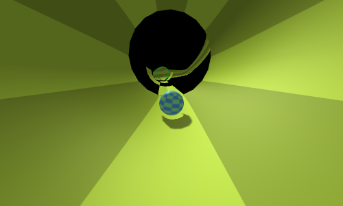
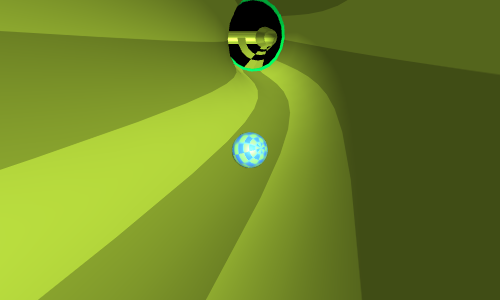

# peer-to-peer-challenge-2014-entry
This was an entry for the Peer to Peer challenge in 2014 (website now offline), however I didn't have enough time to finish the project and didn't end up submitting it. It's a game where you control a ball and roll down a pipe. It's 3D, too.

Since this was meant to be a competition entry, the code is a bit rushed. It was also the first time that I implemented an entity component system and worked with Three.JS.

## Libraries used & bundled
- [three.js](https://github.com/mrdoob/three.js/)
- [Physijs](https://github.com/chandlerprall/Physijs)
- [ammo.js](https://github.com/kripken/ammo.js)
- [ThreeCSG](https://github.com/chandlerprall/ThreeCSG) (though not used, I think)

## Running
Install [Dart &amp; Dartium](https://www.dartlang.org/install). Run `pub get` to update the Dart dependencies of the project. Then you should be able to open [p2pentry/web/p2pentry.html](p2pentry/web/p2pentry.html) in Dartium. If the canvas remains white, use the `--allow-file-access-from-files` flag when starting Dartium.

## Screenshots

## License
See [LICENSE](LICENSE)